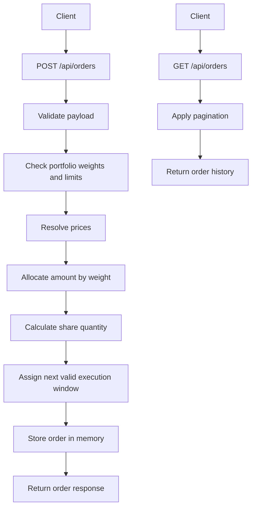

# Order Splitter API

This project is a TypeScript implementation of the Ionixx Backend Developer Technical Challenge.

It exposes a small REST API that:

- accepts a model portfolio and total order amount
- supports both `BUY` and `SELL` orders
- splits the amount across portfolio holdings
- calculates share quantities with configurable precision
- schedules the order for the next valid market window
- stores order history in memory only

For this standalone challenge, both `BUY` and `SELL` are treated as dollar-based allocation requests. The response makes the action explicit on each line item through a `side` field, while quantities remain positive units to buy or sell.

## Overview

The system is designed as a lightweight standalone service with a clear separation between HTTP handling and business logic.

- `src/server.ts`
  Handles routing, request parsing, error responses, and response-time logging.
- `src/services/orderService.ts`
  Contains validation, pricing, allocation, quantity calculation, and execution-date logic.
- `src/store/orderStore.ts`
  Stores orders in memory and returns paginated history.
- `src/config.ts`
  Holds runtime configuration such as precision, limits, and fallback prices.

## Request Flow



## API Endpoints

### `POST /api/orders`

Creates a new order from a model portfolio.

Request body:

```json
{
  "totalAmount": 1000,
  "orderType": "BUY",
  "modelPortfolio": [
    { "symbol": "AAPL", "weight": 60, "price": 210.35 },
    { "symbol": "TSLA", "weight": 40 }
  ]
}
```

Rules:

- `totalAmount` must be a positive number
- `orderType` must be `BUY` or `SELL`
- `modelPortfolio` must contain at least one security
- each security must have a non-empty `symbol`
- each `weight` must be positive
- total weights must sum to `100` within a small tolerance
- `price` is optional, but when provided it must be positive
- request prices take priority over configured fallback prices

`BUY` and `SELL` behavior:

- both order types use the same proportional portfolio-allocation logic
- each response line includes a `side` field so the action is explicit per security
- `quantity` remains a positive unit count; whether those units are bought or sold is determined by `side`
- this keeps the challenge solution simple and PDF-compliant while making the trading intent unambiguous

Scheduling:

- orders are scheduled at `09:30`
- weekend orders move to Monday
- if today’s `09:30` window has already passed, the order moves to the next trading day

Example response:

```json
{
  "data": {
    "id": "4c767b8b-1787-4af0-a93c-f31b4d2af8c4",
    "orderType": "BUY",
    "totalAmount": 1000,
    "modelPortfolio": [
      { "symbol": "AAPL", "weight": 60, "price": 210.35 },
      { "symbol": "TSLA", "weight": 40 }
    ],
    "breakdown": [
      {
        "side": "BUY",
        "symbol": "AAPL",
        "weight": 60,
        "amount": 600,
        "price": 210.35,
        "quantity": 2.852
      },
      {
        "side": "BUY",
        "symbol": "TSLA",
        "weight": 40,
        "amount": 400,
        "price": 248.53,
        "quantity": 1.609
      }
    ],
    "executionDate": "2026-03-19T09:30:00.000Z",
    "createdAt": "2026-03-18T10:45:00.000Z"
  }
}
```

### `GET /api/orders`

Returns paginated historic orders from memory.

Query parameters:

- `page`: default `1`
- `pageSize`: default `25`

Example:

```text
GET /api/orders?page=1&pageSize=10
```

Example response:

```json
{
  "data": [],
  "pagination": {
    "page": 1,
    "pageSize": 10,
    "totalItems": 0,
    "totalPages": 1
  }
}
```

### `GET /health`

Returns a simple health response.

## Performance Notes

Order creation is `O(n)` in the number of portfolio items because the service validates the request, checks the total weight, and builds the final breakdown by iterating through the portfolio.

To keep the API safer under larger inputs, the implementation includes:

- a configurable portfolio-size limit
- paginated history responses
- response-time logging in milliseconds for every HTTP request

## Run Locally

Install dependencies:

```bash
npm install
```

Build the project:

```bash
npm run build
```

Start the server:

```bash
npm start
```

Default base URL:

```text
http://localhost:3000
```

## Curl Examples

Create an order:

```bash
curl -X POST http://localhost:3000/api/orders \
  -H 'Content-Type: application/json' \
  -d '{
    "totalAmount": 1000,
    "orderType": "BUY",
    "modelPortfolio": [
      { "symbol": "AAPL", "weight": 60, "price": 210.35 },
      { "symbol": "TSLA", "weight": 40 }
    ]
  }'
```

Fetch order history:

```bash
curl "http://localhost:3000/api/orders?page=1&pageSize=10"
```

Run a health check:

```bash
curl http://localhost:3000/health
```

## Configuration

Supported environment variables:

- `PORT`: server port, default `3000`
- `QUANTITY_DECIMALS`: share quantity precision, default `3`
- `WEIGHT_TOLERANCE`: allowed tolerance for total portfolio weight, default `0.0001`
- `MAX_PORTFOLIO_ITEMS`: max portfolio size accepted by the API, default `1000`
- `DEFAULT_PAGE_SIZE`: default history page size, default `25`
- `MAX_PAGE_SIZE`: maximum history page size, default `100`

Example:

```bash
QUANTITY_DECIMALS=7 MAX_PORTFOLIO_ITEMS=500 npm start
```

## Testing

Run the tests:

```bash
npm test
```

Current coverage includes:

- price override behavior
- decimal weight handling
- next valid execution window
- invalid weight rejection
- order creation behavior
- paginated history retrieval
- invalid JSON handling
- invalid pagination handling
